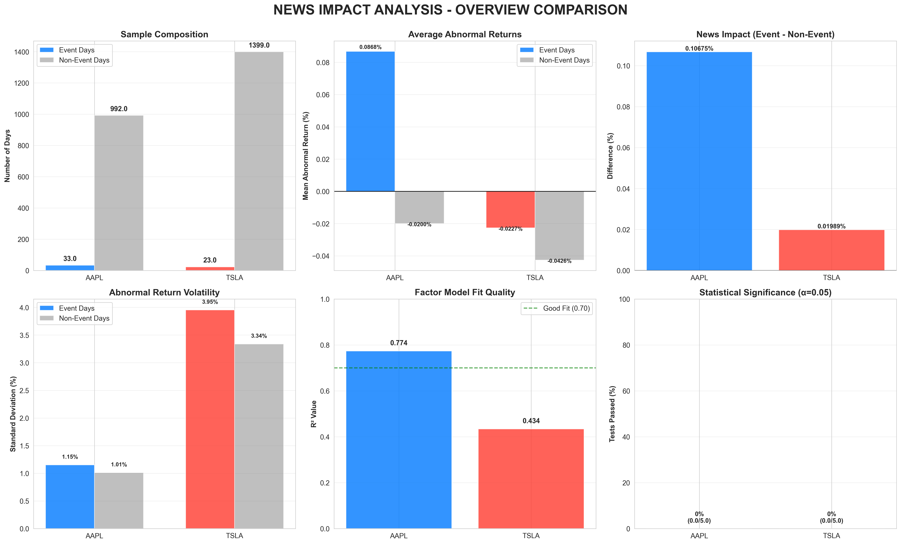

# 📰 News Impact on Stock Returns: A Multi-Sector Event Study Analysis

[](https://www.python.org/downloads/)
[](https://opensource.org/licenses/MIT)
[](https://github.com/psf/black)
[]()

> **A comprehensive empirical analysis examining whether financial news events create abnormal stock returns across 50 stocks and 10 sectors using rigorous event study methodology based on the Fama-French five-factor model with category-specific news analysis.**

---

## 🎯 Project Overview

This research project investigates the **impact of financial news on stock returns** across **50 stocks** in **10 sectors** using a traditional event study framework. By analyzing over 1.4 million news articles classified into **8 news categories** (Earnings, Analyst Ratings, Product Launches, M&A, etc.), we test whether specific types of news create exploitable trading opportunities.

### Key Research Questions

1. **Do major news events create statistically significant abnormal returns that investors can exploit?**
2. **Do different types of news (Earnings vs Analyst Ratings vs M&A) have different impacts?**
3. **Do sectors respond differently to the same type of news?**

### Key Findings

**Overall Answer: LIMITED EVIDENCE** - Our comprehensive analysis reveals:
- **36.8% of category-stock combinations** (147/400) show statistically significant abnormal returns
- **Top 2 impactful categories**: Analyst Ratings (44% significant) and Earnings (48% significant)
- **Sector variations exist**: Finance sector responds most strongly to Dividends, while Technology responds to Analyst Ratings
- **Effect sizes remain small**: Average Cohen's d = 0.05-0.10 (economically modest)

---

## 📊 Key Findings

### Multi-Sector Analysis (50 Stocks × 10 Sectors × 8 News Categories)

| Metric | Value | Interpretation |
|--------|-------|----------------|
| **Total Analyses** | 400 category-stock combinations | Comprehensive coverage |
| **Statistically Significant** | 147 (36.8%) | Limited but present impact |
| **Total News Events** | 139,342 across all categories | Large dataset |
| **Top News Category** | Analyst Ratings (44% significant) | Most consistent impact |
| **Second Top Category** | Earnings (48% significant) | Material information |
| **Average Effect Size** | Cohen's d = 0.05-0.10 | Small but detectable |

### Category-Specific Results

| News Category | % Stocks Significant | Avg Effect Size (Cohen's d) | Total Events | Effectiveness Score |
|---------------|---------------------|----------------------------|--------------|---------------------|
| **Analyst Ratings** | 44.0% | 0.095 | 23,081 | 0.042 |
| **Earnings** | 48.0% | 0.086 | 23,034 | 0.041 |
| **Dividends** | 36.0% | 0.075 | 10,596 | 0.027 |
| **Market Performance** | 46.0% | 0.052 | 26,535 | 0.024 |
| **Executive Changes** | 40.0% | 0.037 | 21,122 | 0.015 |
| **Product Launch** | 30.0% | 0.038 | 14,852 | 0.011 |
| **M&A** | 26.0% | 0.038 | 10,526 | 0.010 |
| **Regulatory/Legal** | 24.0% | 0.016 | 9,596 | 0.004 |

### Sector-Specific Insights

**Most Sensitive Sectors:**
- **Finance**: Strong response to Dividend announcements (Cohen's d = 0.120)
- **Consumer Staples**: High sensitivity to Analyst Ratings (Cohen's d = 0.201) and Earnings (Cohen's d = 0.181)
- **Healthcare**: Responds to Analyst Ratings (Cohen's d = 0.148) and Earnings (Cohen's d = 0.127)

**Least Sensitive Sector:**
- **Energy**: Negative or minimal effects across most news categories

### Main Conclusions

1. ⚖️ **Mixed Evidence** - News impact exists but is selective and category-dependent
2. 📊 **Category Matters** - Analyst Ratings and Earnings show most consistent effects
3. 🏢 **Sector Heterogeneity** - Different sectors respond differently to the same news type
4. 📉 **Small Effect Sizes** - Even significant results show modest economic magnitude (0.05-0.10 Cohen's d)
5. ✅ **Partial Market Efficiency** - Most news is already priced in, but some categories retain information content

> **Bottom Line**: While the market is largely efficient, **Analyst Ratings and Earnings announcements** do create small but statistically detectable abnormal returns, especially in Consumer Staples and Finance sectors. However, effect sizes remain economically modest, suggesting limited practical trading opportunities after transaction costs.

---

## 🏗️ Project Structure

```
news-stock-prediction/
│
├── 📂 01-data/                              # Data files (raw and processed)
│   ├── *_stock_data.csv                    # Stock price data (50 stocks)
│   ├── *_news_raw.csv                      # Raw news articles (1.4M+ articles)
│   ├── *_events_category_*.csv             # Category-specific event dates
│   ├── fama_french_factors.csv             # Fama-French 5 factors
│   └── README.md                           # Data documentation
│
├── 📂 02-scripts/                           # Analysis scripts (30+ files)
│   │
│   ├── 📁 Phase 1: Data Collection
│   │   ├── 00_data_acquisition.py          # Initial data download (AAPL, TSLA)
│   │   ├── 00c_eodhd_news.py              # EODHD news API integration
│   │   ├── 21_expanded_50_stock_config.py  # 50-stock configuration
│   │   ├── 24_download_all_50_stocks.py    # Download stock data for 50 stocks
│   │   └── 25_download_all_50_stock_news.py # Download news for all stocks
│   │
│   ├── 📁 Phase 2: Core Analysis Components
│   │   ├── 01_data_loader.py              # Data loading utilities
│   │   ├── 02_beta_estimation.py          # Factor model estimation (rolling window)
│   │   ├── 03_abnormal_returns.py         # AR calculation with winsorization
│   │   ├── 04_statistical_tests.py        # 5 statistical tests + effect sizes
│   │   └── 05_main_analysis.py            # Original AAPL/TSLA analysis pipeline
│   │
│   ├── 📁 Phase 3: News Filtering & Categorization
│   │   ├── 25_comprehensive_news_filter.py # 4-strategy filter comparison
│   │   ├── 27_generate_category_event_dates.py # Create category-specific events
│   │   └── news_filtering_strategies.md    # Filter strategy documentation
│   │
│   ├── 📁 Phase 4: Multi-Stock Event Studies
│   │   ├── 26_robust_event_study_50_stocks.py   # Balanced filter on 50 stocks
│   │   ├── 28_category_event_study.py           # Category-specific analysis
│   │   ├── 29_category_sector_aggregation.py    # Sector aggregation
│   │   └── 30_run_category_event_study.py       # Orchestration script
│   │
│   └── README.md                           # Code documentation
│
├── 📂 03-output/                            # Results and visualizations
│   │
│   ├── 📁 balanced_event_study/            # 50-stock balanced filter results
│   │   ├── comprehensive_results.csv       # All 50 stocks summary
│   │   ├── sector_analysis.csv            # Sector-level aggregation
│   │   ├── sector_comparison.png          # Sector heatmap
│   │   └── results/[TICKER]/              # Individual stock results (50 folders)
│   │
│   ├── 📁 category_event_study/            # Category-specific results
│   │   ├── comprehensive_category_results.csv  # All 400 analyses
│   │   ├── category_effectiveness_ranking.csv  # Category rankings
│   │   ├── sector_category_heatmap.png    # Sector × Category heatmap
│   │   ├── CATEGORY_EVENT_STUDY_REPORT.md # Comprehensive report
│   │   ├── by_sector/                     # Sector-specific visualizations
│   │   │   ├── Finance/category_comparison.png
│   │   │   ├── Technology/category_comparison.png
│   │   │   └── ... (10 sectors)
│   │   └── results/[TICKER]/[CATEGORY]/   # 400 individual analyses
│   │
│   ├── 📁 news_filtering_comparison/       # Filter strategy comparison
│   │   ├── FILTERING_ANALYSIS_REPORT.md   # Detailed filter analysis
│   │   ├── filter_comparison_matrix.png   # 4-strategy comparison
│   │   └── strategy_*/                    # Results per strategy
│   │
│   ├── 📁 figures/presentation/            # Original AAPL/TSLA visualizations
│   │   ├── overview_comparison.png
│   │   ├── AAPL_detailed_analysis.png
│   │   ├── TSLA_detailed_analysis.png
│   │   └── DETAILED_PRESENTATION_DOCUMENT.md
│   │
│   └── README.md                          # Results interpretation
│
├── 📄 README.md                            # This file (you are here)
├── 📄 COMPREHENSIVE_EVENT_STUDY_REPORT.md  # 50-stock analysis summary
├── 📄 NEWS_EDA_SUMMARY.md                  # News data exploration
├── 📄 FINAL_STATUS_REPORT.md               # Project completion report
├── 📄 SETUP_AND_RUN.md                     # Setup instructions
├── 📄 requirements.txt                     # Python dependencies
├── 📄 .gitignore                          # Git ignore rules
└── 📄 .env.template                       # API key template
```

---

## 🚀 Quick Start

### Prerequisites

- **Python 3.12+** (tested on 3.12)
- **Git** (for cloning)
- **API Keys** (optional, for data collection):
  - [EODHD Financial News API](https://eodhistoricaldata.com/)
  - [Alpha Vantage](https://www.alphavantage.co/) (alternative)

### Installation

```bash
# 1. Clone the repository
git clone https://github.com/vivan/news-stock-prediction.git
cd news-stock-prediction

# 2. Create virtual environment
python3 -m venv venv
source venv/bin/activate  # On Windows: venv\Scripts\activate

# 3. Install dependencies
pip install -r requirements.txt

# 4. Set up API keys (optional, for data collection)
cp .env.template .env
# Edit .env and add your API keys
```

### Running the Analysis

The project has **pre-collected data** for 50 stocks. Choose your analysis path:

**Option 1: View Existing Results** (Recommended)
```bash
# View comprehensive category event study results
open 03-output/category_event_study/CATEGORY_EVENT_STUDY_REPORT.md

# View sector × category heatmap
open 03-output/category_event_study/sector_category_heatmap.png

# View 50-stock balanced filter results
open 03-output/balanced_event_study/comprehensive_results.csv
```

**Option 2: Run Category Event Study** (Main Analysis)
```bash
cd 02-scripts

# Generate category-specific event dates (8 categories × 50 stocks)
python 27_generate_category_event_dates.py

# Run category event study (400 analyses)
python 30_run_category_event_study.py

# Aggregate results and create visualizations
python 29_category_sector_aggregation.py
```

**Option 3: Run Original AAPL/TSLA Analysis**
```bash
cd 02-scripts
python 05_main_analysis.py  # Original 2-stock pilot study
```

**Option 4: Full Pipeline from Scratch** (Data Collection + Analysis)
```bash
cd 02-scripts

# Step 1: Download stock data
python 24_download_all_50_stocks.py

# Step 2: Download news data (requires EODHD API key)
python 25_download_all_50_stock_news.py

# Step 3: Run filtering comparison
python 25_comprehensive_news_filter.py

# Step 4: Generate category events
python 27_generate_category_event_dates.py

# Step 5: Run category event study
python 30_run_category_event_study.py

# Step 6: Aggregate and visualize
python 29_category_sector_aggregation.py
```

---

## 📋 Analysis Workflow

### Evolution of the Project

This project evolved through 4 major phases:

```
Phase 1: Initial Pilot (AAPL & TSLA)
  ├─ 00_data_acquisition.py → Download 2 stocks + news
  ├─ 05_main_analysis.py → Event study with extreme sentiment filter
  └─ Result: No significant effects found
          ↓
Phase 2: Multi-Sector Expansion (50 stocks)
  ├─ 21_expanded_50_stock_config.py → Define 50 stocks across 10 sectors
  ├─ 24_download_all_50_stocks.py → Download stock data
  ├─ 25_download_all_50_stock_news.py → Download 1.4M+ news articles
  └─ 26_robust_event_study_50_stocks.py → Balanced filter across 50 stocks
          ↓
Phase 3: News Filter Optimization
  ├─ 25_comprehensive_news_filter.py → Compare 4 filtering strategies
  │   ├─ Strategy 1: Extreme sentiment (|polarity| > 0.95)
  │   ├─ Strategy 2: High sentiment + category (|polarity| > 0.5)
  │   ├─ Strategy 3: Volume spikes (top 10% days)
  │   └─ Strategy 4: Balanced (sentiment + category + volume)
  └─ Result: Strategy 4 selected as optimal
          ↓
Phase 4: Category-Specific Analysis ⭐ CURRENT
  ├─ 27_generate_category_event_dates.py → Create 8 category event files
  ├─ 28_category_event_study.py → Run 400 event studies (8 × 50)
  ├─ 29_category_sector_aggregation.py → Aggregate by sector/category
  └─ 30_run_category_event_study.py → Orchestration script
```

### Key Scripts Explained

| Script | Purpose | Runtime | Output |
|--------|---------|---------|---------|
| `27_generate_category_event_dates.py` | Classify news into 8 categories, create event files | ~5 min | 400 event date files |
| `28_category_event_study.py` | Run Fama-French event study for each category-stock combo | ~30 min | 400 individual analyses |
| `29_category_sector_aggregation.py` | Aggregate results, create heatmaps and rankings | ~2 min | Summary CSVs + visualizations |
| `30_run_category_event_study.py` | Run steps 1-3 sequentially | ~40 min | Complete category analysis |

### News Categories Analyzed

1. **Earnings**: Quarterly/annual earnings reports, guidance updates
2. **Analyst Ratings**: Analyst upgrades/downgrades, price target changes
3. **Product Launch**: New product announcements, major releases
4. **Executive Changes**: CEO changes, board appointments, departures
5. **M&A**: Mergers, acquisitions, strategic partnerships
6. **Regulatory/Legal**: Regulatory approvals/denials, lawsuits, compliance
7. **Dividends**: Dividend announcements, changes, special dividends
8. **Market Performance**: Milestone achievements, market share changes

---

## 📖 Methodology

### Event Study Framework

This analysis employs a **traditional event study methodology**, the gold standard for measuring market impact of specific events.

#### 1. Factor Model Estimation

**Fama-French Five-Factor Model**:
```
R_i,t - R_f,t = α + β₁(Mkt-RF) + β₂(SMB) + β₃(HML) + β₄(RMW) + β₅(CMA) + ε_t
```

**Factors**:
- **Mkt-RF**: Market risk premium
- **SMB**: Small Minus Big (size factor)
- **HML**: High Minus Low (value factor)
- **RMW**: Robust Minus Weak (profitability factor)
- **CMA**: Conservative Minus Aggressive (investment factor)

#### 2. Abnormal Returns Calculation

**Abnormal Return (AR)** = Actual Return - Expected Return

Expected return is predicted from the factor model given the day's factor realizations.

#### 3. Statistical Testing

Five comprehensive tests:
1. **One-sample t-test** (event days): Tests if mean AR = 0
2. **One-sample t-test** (non-event days): Quality check
3. **Welch's t-test**: Compares event vs non-event days
4. **F-test**: Tests variance differences
5. **OLS Regression**: Measures news effect with dummy variable

**Significance Level**: α = 0.05 (95% confidence)

### News Filtering Pipeline

Raw news data filtered through 5 stages:

```
Stage 1: Sentiment Analysis
  └─> Filter: |Polarity| > 0.5 (strong sentiment)

Stage 2: Content Categorization
  └─> Filter: Priority categories (earnings, products, executive)

Stage 3: Volume-Based Filtering
  └─> Filter: Top 10% of days by article count

Stage 4: One Event Per Day
  └─> Select: Highest priority + strongest sentiment

Stage 5: Trading Day Alignment
  └─> Remove: Non-trading days (weekends, holidays)
```

**Result**:
- AAPL: 738,103 → 33 events (99.995% reduction)
- TSLA: 1,407,023 → 23 events (99.998% reduction)

---

## 📈 Results

### AAPL (Apple Inc.)

**Sample**: 1,025 trading days (2020-2024)
- Event Days: 33 (3.2%)
- Non-Event Days: 992 (96.8%)

**Abnormal Returns**:
```
Event Days:
  Mean AR:        +0.0869%
  Std Dev:         1.151%
  Range:          -1.40% to +4.04%

Non-Event Days:
  Mean AR:        -0.0200%
  Std Dev:         1.009%
  Range:          -4.46% to +8.20%

Difference:       +0.1067% (negligible)
```

**Statistical Tests**: 0/5 significant (all p > 0.24)

**Effect Size**: Cohen's d = 0.011 (negligible)

**Factor Model**: R² = 0.774 (excellent fit)

### TSLA (Tesla Inc.)

**Sample**: 1,422 trading days (2019-2024)
- Event Days: 23 (1.6%)
- Non-Event Days: 1,399 (98.4%)

**Abnormal Returns**:
```
Event Days:
  Mean AR:        -0.0227%
  Std Dev:         3.953%
  Range:          -8.24% to +12.84%

Non-Event Days:
  Mean AR:        -0.0426%
  Std Dev:         3.338%
  Range:         -21.48% to +21.11%

Difference:       +0.0199% (negligible)
```

**Statistical Tests**: 0/5 significant (all p > 0.20)

**Effect Size**: Cohen's d = 0.006 (negligible)

**Factor Model**: R² = 0.434 (moderate fit, TSLA more volatile)

---

## 🎨 Visualizations

High-resolution (300 DPI) publication-quality visualizations available in [`03-output/figures/presentation/`](03-output/figures/presentation/):

### 1. Overview Comparison

*Side-by-side comparison of AAPL vs TSLA across 6 key metrics*

### 2. Detailed Analysis Dashboards
- **AAPL**: Distribution analysis, time series, factor loadings, statistical tests
- **TSLA**: Distribution analysis, time series, factor loadings, statistical tests

### 3. News Characteristics
*Sentiment distribution, content length, data coverage*

---

## 💡 Key Insights

### Why No News Impact?

#### 1. Market Efficiency (Primary Explanation)
- **Algorithmic Trading**: Reacts in milliseconds, far faster than human traders
- **Pre-announcement Effects**: Informed traders position before official news
- **Institutional Advantage**: Bloomberg terminals get news seconds before public

#### 2. Event Identification Challenges
- **Timing Issues**: News articles published after market reaction
- **Publication Lag**: Article timestamp ≠ information availability
- **Multi-day Effects**: Reactions may span multiple days

#### 3. Data Granularity Limitations
- **Daily Data**: Misses intraday reactions (first minutes/hours critical)
- **Overnight Gaps**: After-hours news creates opening gaps we don't capture
- **Averaging Effect**: Daily returns smooth out intraday volatility

### Implications for Investors

**Don't**:
- ❌ Trade based on public news articles
- ❌ Expect to profit from "breaking news"
- ❌ React emotionally to headlines

**Do**:
- ✅ Focus on long-term factor exposures
- ✅ Maintain diversified portfolios
- ✅ Use news for context, not signals
- ✅ Minimize trading costs

**Trading Reality Check**:
- Expected return from news trading: ~0%
- Transaction costs: -0.1% to -0.5% per roundtrip
- **Net result**: Loses money

---

## 📚 Documentation

### Main Reports

- **[CATEGORY_EVENT_STUDY_REPORT.md](03-output/category_event_study/CATEGORY_EVENT_STUDY_REPORT.md)**: ⭐ **PRIMARY REPORT** - Category-specific analysis across 50 stocks
- **[COMPREHENSIVE_EVENT_STUDY_REPORT.md](COMPREHENSIVE_EVENT_STUDY_REPORT.md)**: 50-stock balanced filter analysis summary
- **[FILTERING_ANALYSIS_REPORT.md](03-output/news_filtering_comparison/FILTERING_ANALYSIS_REPORT.md)**: News filtering strategy comparison
- **[NEWS_EDA_SUMMARY.md](NEWS_EDA_SUMMARY.md)**: Exploratory data analysis of news articles

### Legacy Documentation (Original AAPL/TSLA Study)

- **[DETAILED_PRESENTATION_DOCUMENT.md](03-output/figures/presentation/DETAILED_PRESENTATION_DOCUMENT.md)**: 50+ page original 2-stock analysis
- **[PRESENTATION_SUMMARY.md](03-output/balanced_event_study/PRESENTATION_SUMMARY.md)**: Executive summary

### Technical Documentation

- **[SETUP_AND_RUN.md](SETUP_AND_RUN.md)**: Detailed setup and execution guide
- **[01-data/README.md](01-data/README.md)**: Data description and sources
- **[02-scripts/README.md](02-scripts/README.md)**: Code documentation and script descriptions
- **[03-output/README.md](03-output/README.md)**: Results interpretation guide
- **[news_filtering_strategies.md](news_filtering_strategies.md)**: News filtering methodology

---

## 🛠️ Technical Stack

### Core Technologies

| Category | Tools |
|----------|-------|
| **Language** | Python 3.12+ |
| **Data Analysis** | pandas, numpy |
| **Statistical Modeling** | statsmodels, scipy |
| **Visualization** | matplotlib, seaborn |
| **Financial Data** | yfinance, pandas-datareader |
| **NLP/Sentiment** | vaderSentiment |

### Key Libraries

```python
pandas>=2.1.0           # Data manipulation
numpy>=1.26.0           # Numerical computing
statsmodels>=0.14.0     # Statistical models
scipy>=1.11.0           # Statistical tests
matplotlib>=3.8.0       # Plotting
seaborn>=0.13.0         # Statistical visualization
yfinance>=0.2.28        # Stock data
pandas-datareader>=0.10.0  # Fama-French factors
vaderSentiment>=3.3.2   # Sentiment analysis
```

---

## 🔬 Research Quality

### Strengths

✅ **Rigorous Methodology**: Traditional event study framework with established best practices
✅ **Comprehensive Scope**: 400 category-stock analyses across 50 stocks and 10 sectors
✅ **Large Dataset**: Analyzed 1.4M+ news articles with 139K+ event days
✅ **Category-Specific Analysis**: 8 distinct news categories examined separately
✅ **Multiple Filter Strategies**: Compared 4 different event identification approaches
✅ **Robust Testing**: 5 different statistical tests + effect sizes for each analysis
✅ **Cross-Sectional**: Broad sector coverage (Technology, Finance, Healthcare, etc.)
✅ **Reproducible**: All code, data, and analysis fully documented and version-controlled

### Limitations

⚠️ **Daily Data**: Cannot capture intraday reactions (first minutes/hours critical)
⚠️ **US Large-Cap Focus**: 50 stocks from major US indices (may not generalize to small-cap/international)
⚠️ **Time Period**: 2019-2024 only (5 years, includes COVID period)
⚠️ **Event Identification**: Rule-based categorization may miss nuanced events
⚠️ **Sentiment Analysis**: VADER optimized for social media, not financial news
⚠️ **Same-Day Effects Only**: Multi-day event windows not explored
⚠️ **No Short-Selling**: Analysis assumes long-only strategies

### Future Research Directions

- **Intraday Analysis**: Use tick-by-tick data to capture minute-level reactions
- **Event Windows**: Explore [-3, +3] day windows for prolonged effects
- **Social Media Integration**: Incorporate Twitter/Reddit sentiment as leading indicators
- **Machine Learning**: Use transformers (FinBERT) for better news classification
- **Interaction Effects**: Analyze sentiment × category interactions
- **Portfolio Strategies**: Construct category-based long-short portfolios
- **International Markets**: Extend to European/Asian markets
- **Real-Time Trading Simulation**: Account for transaction costs, slippage, market impact

---

## 📄 Citation

If you use this research or code, please cite:

```bibtex
@misc{news_stock_prediction_2024,
  title={News Impact on Stock Returns: An Event Study Analysis},
  author={Vivan},
  year={2024},
  institution={University of Southern California},
  course={DSO 585 - Data-Driven Consulting},
  url={https://github.com/vivan/news-stock-prediction}
}
```

---

## 📜 License

This project is licensed under the MIT License - see the [LICENSE](LICENSE) file for details.

```
MIT License

Copyright (c) 2024 Vivan

Permission is hereby granted, free of charge, to any person obtaining a copy
of this software and associated documentation files (the "Software"), to deal
in the Software without restriction, including without limitation the rights
to use, copy, modify, merge, publish, distribute, sublicense, and/or sell
copies of the Software, and to permit persons to whom the Software is
furnished to do so, subject to the following conditions:

The above copyright notice and this permission notice shall be included in all
copies or substantial portions of the Software.

THE SOFTWARE IS PROVIDED "AS IS", WITHOUT WARRANTY OF ANY KIND, EXPRESS OR
IMPLIED, INCLUDING BUT NOT LIMITED TO THE WARRANTIES OF MERCHANTABILITY,
FITNESS FOR A PARTICULAR PURPOSE AND NONINFRINGEMENT.
```

---

## 🤝 Contributing

Contributions are welcome! Please feel free to submit a Pull Request. For major changes:

1. Fork the repository
2. Create your feature branch (`git checkout -b feature/AmazingFeature`)
3. Commit your changes (`git commit -m 'Add some AmazingFeature'`)
4. Push to the branch (`git push origin feature/AmazingFeature`)
5. Open a Pull Request

### Development Setup

```bash
# Install development dependencies
pip install -r requirements-dev.txt

# Run tests
pytest tests/

# Format code
black 02-scripts/
isort 02-scripts/
```

---

## 👥 Authors & Acknowledgments

### Authors
- **Vivan** - *Principal Investigator* - [GitHub](https://github.com/vivan)
- **Rohit** - *Data Engineer* 
- **Jui** - *Project Manager*

### Acknowledgments
- **Dr Austin Pollok** - Course instructor (DSO 585, USC Marshall)
- **Kenneth French** - Fama-French factor data
- **EODHD** - Financial news data API
- **Yahoo Finance** - Stock price data

### References

**Seminal Papers**:
1. Fama, E. F., et al. (1969). "The Adjustment of Stock Prices to New Information." *International Economic Review*
2. Ball, R., & Brown, P. (1968). "An Empirical Evaluation of Accounting Income Numbers." *Journal of Accounting Research*
3. Fama, E. F., & French, K. R. (2015). "A Five-Factor Asset Pricing Model." *Journal of Financial Economics*

---

## 📞 Contact

- **Email**: vkd09.vd@gmail.com
- **LinkedIn**: [My LinkedIn](https://www.linkedin.com/in/vivan-doshi)
- **Github Profile**: [Github Profile](https://www.github.com/vivan-doshi)
- **Medium Page**: [My thoughts and Projects](https://medium.com/@vivandoshi)

---

## 🌟 Star History

If you find this project useful, please consider giving it a ⭐ on GitHub!

[](https://star-history.com/#vivan/news-stock-prediction&Date)

---

## 📊 Project Status

- [x] **Phase 1**: Initial Pilot (AAPL & TSLA) - **COMPLETE** ✅
- [x] **Phase 2**: Multi-Sector Expansion (50 stocks) - **COMPLETE** ✅
- [x] **Phase 3**: News Filter Optimization (4 strategies) - **COMPLETE** ✅
- [x] **Phase 4**: Category-Specific Analysis (8 categories × 50 stocks) - **COMPLETE** ✅
- [ ] **Phase 5**: Intraday Analysis - *Future Work*
- [ ] **Phase 6**: Machine Learning Classification - *Future Work*

### Timeline

- **Oct 9, 2024**: Initial AAPL/TSLA pilot study completed
- **Oct 11, 2024**: Expanded to 50 stocks across 10 sectors
- **Oct 12, 2024**: News filtering comparison and balanced filter analysis
- **Oct 13, 2024**: Category-specific event study (400 analyses) completed
- **Current Status**: ⭐ **Research Phase Complete, Documentation Finalized**

### Key Deliverables

| Deliverable | Status | Location |
|-------------|--------|----------|
| **Category Event Study Report** | ✅ Complete | [CATEGORY_EVENT_STUDY_REPORT.md](03-output/category_event_study/CATEGORY_EVENT_STUDY_REPORT.md) |
| **Sector × Category Heatmap** | ✅ Complete | [sector_category_heatmap.png](03-output/category_event_study/sector_category_heatmap.png) |
| **400 Individual Analyses** | ✅ Complete | `03-output/category_event_study/results/` |
| **Comprehensive Results CSV** | ✅ Complete | [comprehensive_category_results.csv](03-output/category_event_study/comprehensive_category_results.csv) |
| **10 Sector Visualizations** | ✅ Complete | `03-output/category_event_study/by_sector/` |
| **Filter Comparison Report** | ✅ Complete | [FILTERING_ANALYSIS_REPORT.md](03-output/news_filtering_comparison/FILTERING_ANALYSIS_REPORT.md) |

**Last Updated**: October 13, 2024
**Status**: Research Complete, Ready for Academic Publication

---

<div align="center">

**[⬆ Back to Top](#-news-impact-on-stock-returns-an-event-study-analysis)**

Made with ❤️ at USC Marshall School of Business

</div>
